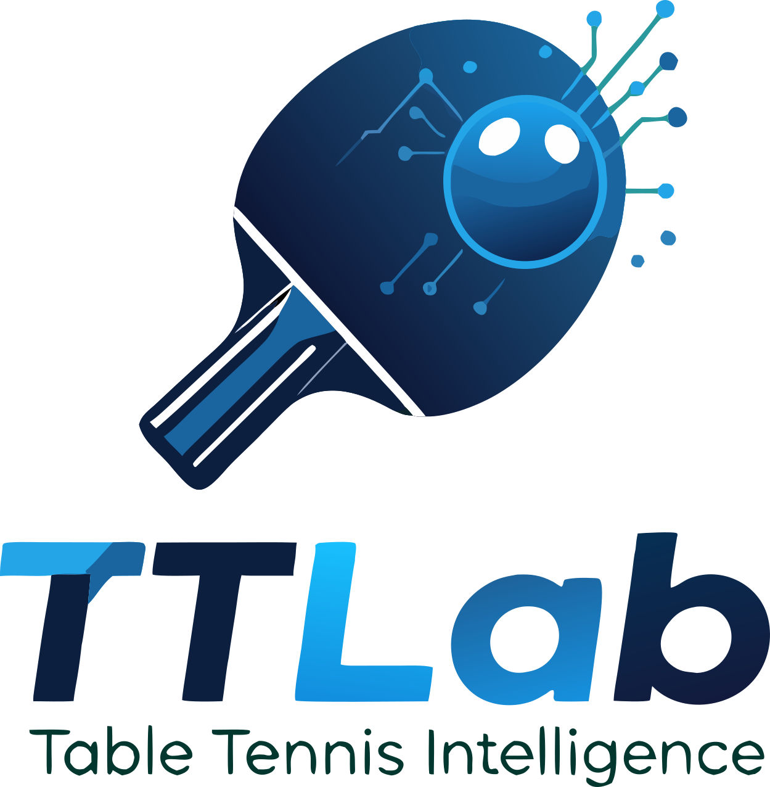
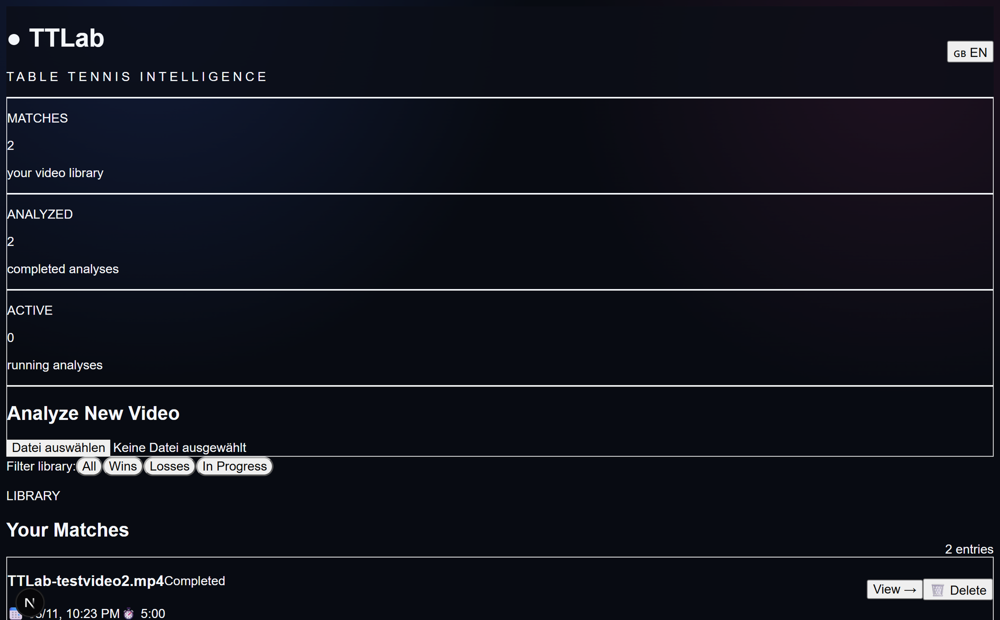
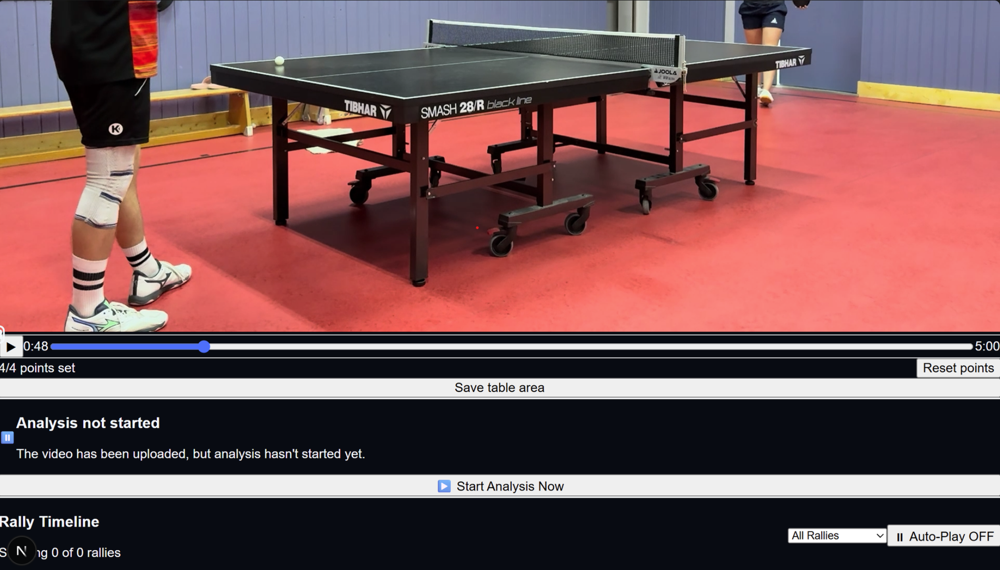
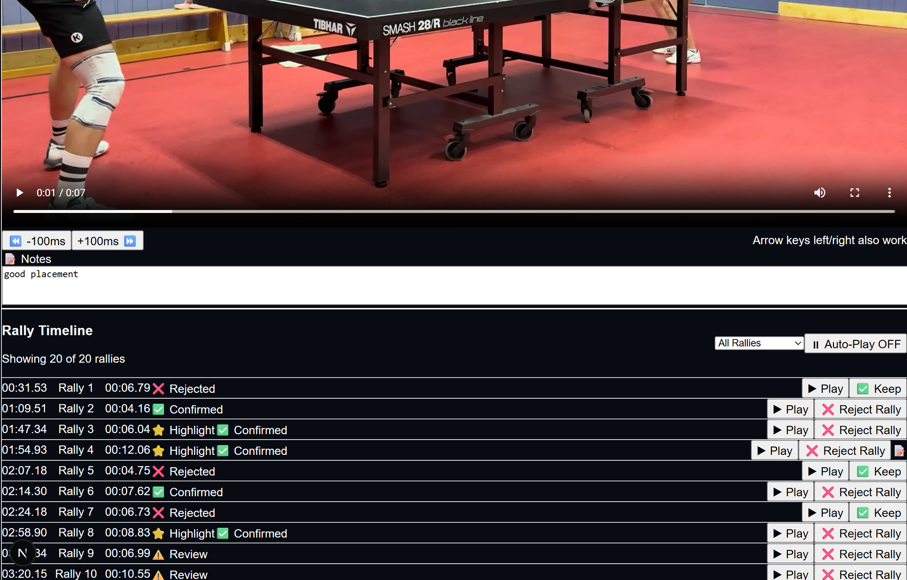

<div align="center">



# TTLab – KI-gestützte Tischtennis-Videoanalyse

*Table Tennis Intelligence*

</div>

[](https://github.com/yourusername/ttlab/releases)
[](LICENSE)
[](https://python.org)
[](https://nextjs.org)

**Automatische Ballwechsel-Erkennung für Tischtennis-Videos – 100% lokal, ohne Cloud-Zwang.**

---

## Überblick

TTLab ist eine Open-Source-Alternative zu vergleichbaren kommerziellen Plattformen. Die Software analysiert Trainingsvideos automatisch, erkennt Ballwechsel durch KI-gestützte Bewegungs- und Audioanalyse, und extrahiert diese als einzelne Clips – alles lokal auf deinem Rechner ohne Abo-Kosten oder Datenweitergabe an Dritte.

### Kernfunktionen

- **Automatische Rally-Erkennung** – Kombination aus Motion Detection, Audio-Peaks und Ball-Tracking
- **100% Lokal & Privat** – Keine Cloud, keine API-Calls, Videos bleiben privat
- **Match-Verwaltung** – Metadaten, Statistiken, Filter nach Sieg/Niederlage
- **Schnelle Analyse** – Asynchrone Verarbeitung im Hintergrund mit Fortschrittsanzeige
- **Manuelle Kalibrierung** – Interaktive Tischmarkierung für präzisere Erkennung
- **Clip-Export** – Alle akzeptierten Highlights als einzelnes Video exportieren

---

## Screenshots


*Dashboard mit Match-Übersicht, Statistiken und Upload-Bereich.*


*Interaktive Tischmarkierung – 4 Ecken klicken um den Spielbereich zu definieren.*


*Rally-Timeline mit Notizen, Filtern und Validierungsstatus für jeden Ballwechsel.*

---

## Schnelleinstieg

### Ein-Klick-Start (Windows)

Nach der Installation einfach doppelt auf **"TTLab starten.bat"** auf dem Desktop klicken.

### Voraussetzungen

| Software | Version | Link |
|----------|---------|------|
| Python | 3.13+ | [Download](https://python.org) |
| Node.js | 20+ | [Download](https://nodejs.org) |
| FFmpeg | 7.x | [Anleitung](https://www.gyan.dev/ffmpeg/builds/) |

### Installation

```bash
# 1. Repository klonen
git clone https://github.com/DEIN_USERNAME/ttlab.git
cd ttlab

# 2. Backend installieren
cd backend
uv venv
.\venv\Scripts\activate
uv pip install -r requirements.txt

# 3. Frontend installieren
cd ../frontend
npm install
```

**Hinweis:** FFmpeg wird für die Clip-Erstellung benötigt.

---

## Bedienung

### Workflow

1. **Video hochladen** – MP4, AVI, MOV, MKV oder WebM über das Frontend
2. **Tisch markieren** – 4 Ecken im Video anklicken (einmal pro Match)
3. **Analyse starten** – Klick auf "Analyse jetzt starten"
4. **Rallies prüfen** – Timeline durchgehen, falsche Erkennungen ablehnen
5. **Highlights exportieren** – Alle akzeptierten Ballwechsel als Video

### Filter

- **Alle Rallys** – Vollständige Liste
- **Highlights** – Manuell markierte Top-Ballwechsel
- **Ballwechsel** – Nur akzeptierte Rallys
- **Kein Ballwechsel** – Abgelehnte Erkennungen

### Sprachumschaltung

Oben rechts zwischen Deutsch und Englisch wechseln.

---

## Roadmap

| Version | Status | Features |
|---------|--------|----------|
| V0.1 | Veröffentlicht | Video Upload, Rally Detection (Motion + Audio), Clip-Export |
| V0.2 | Veröffentlicht | Match-Metadaten, Statistik-Dashboard, Ergebnis-Filter |
| V0.3 | Veröffentlicht | Tischkalibrierung, Rally-Validierung, 100ms-Navigation |
| V0.4 | In Arbeit | Trainiertes YOLOv8n-Ball-Tracking, Labeling-Tool |
| V0.5 | Geplant | Player Detection, Pose Estimation, Schlagtyp-Erkennung |
| V0.6 | Geplant | Taktik-Analyse, Heatmaps, Schwachstellen-Erkennung |
| V1.0 | Geplant | KI-Coach (LLM), Spielerprofile, Trainingspläne |

---

## Architektur

```
┌─────────────────────┐
│   Next.js Frontend  │  Port 3000
│   (React 19, TS)    │
└──────────┬──────────┘
           │ REST API
┌──────────▼──────────┐
│   FastAPI Backend   │  Port 8000
│   (Python 3.13)     │
└──────────┬──────────┘
           │ SQLAlchemy
┌──────────▼──────────┐
│   SQLite / PostgreSQL │
└──────────┬──────────┘
           │ Filesystem
┌──────────▼──────────┐
│   data/videos/      │
│   data/clips/       │
└─────────────────────┘
```

### Tech Stack

**Backend:** Python 3.13, FastAPI, OpenCV, librosa, SQLAlchemy, FFmpeg  
**Frontend:** Next.js 19, React 19, TypeScript, Tailwind CSS  
**CV/ML:** OpenCV MOG2, Audio Peak Detection, YOLOv8 (geplant)

---

## Mitmachen

- Fehler über [Issues](https://github.com/DEIN_USERNAME/ttlab/issues) melden
- Feature-Wünsche in [Discussions](https://github.com/DEIN_USERNAME/ttlab/discussions)
- Pull Requests willkommen

---

## FAQ

**F: Warum wird mein Video nicht analysiert?**  
A: FFmpeg muss installiert und im PATH sein. Backend-Console prüfen.

**F: Kann ich TTLab auf einem Server betreiben?**  
A: Ja! Siehe Deployment-Dokumentation.

**F: Wie genau ist die Rally-Erkennung?**  
A: V0.3 erreicht ~60-70% Precision. V0.4 zielt auf >90%.

**F: Sind mehrere Benutzer möglich?**  
A: Aktuell nein. Für V1.0 geplant.

---

## Lizenz

Dieses Projekt ist proprietär. Alle Rechte vorbehalten. Kommerzielle Nutzung nur mit Genehmigung. Siehe [LICENSE](LICENSE) für Details.

---

## Danksagung

Entwickelt mit [opencode](https://opencode.ai). Dank an die Tischtennis-Community und Open-Source-Projekte wie OpenCV, FastAPI und Next.js.

---

<div align="center">

**Für Tischtennisspieler entwickelt**

</div>
