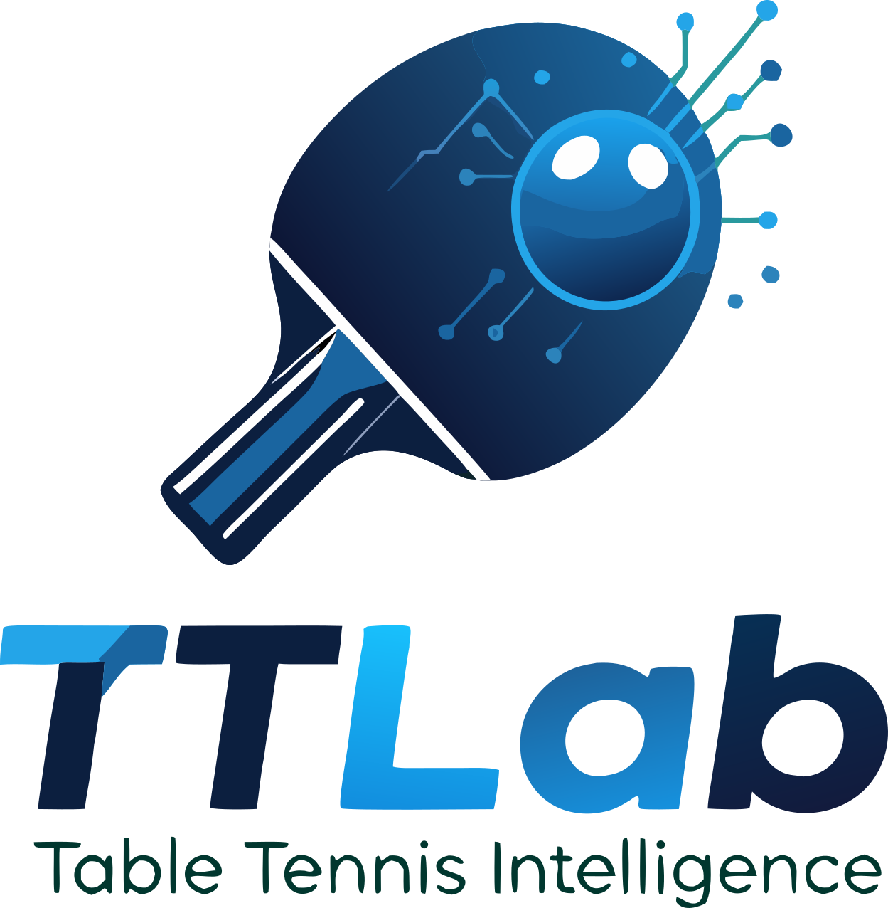
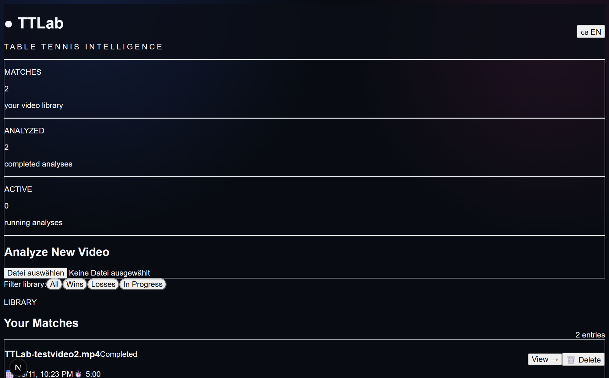
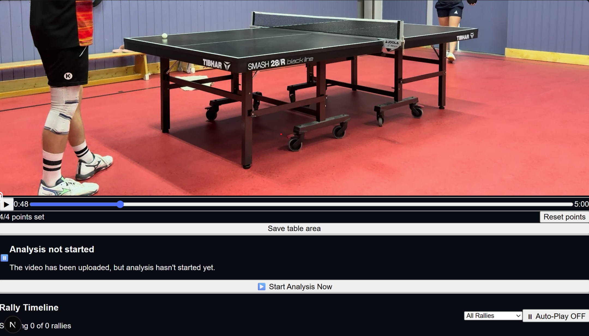
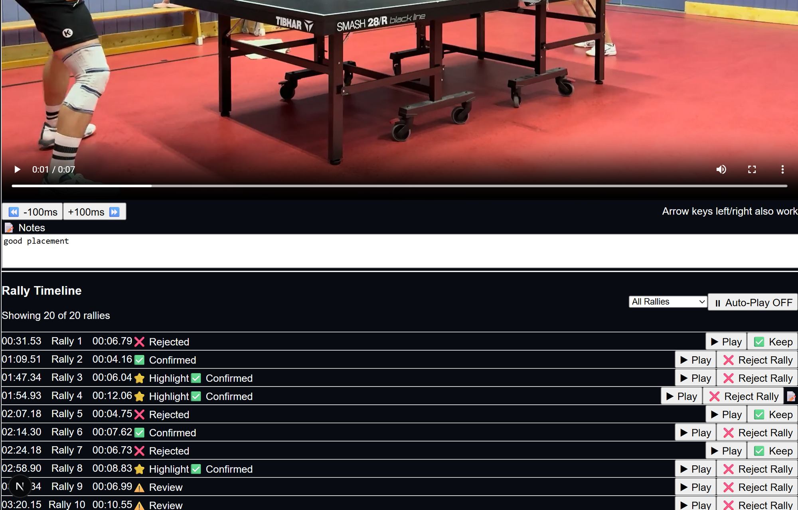

<div align="center">



# TTLab – AI-Powered Table Tennis Video Analysis

*Table Tennis Intelligence*

</div>

[](https://github.com/yourusername/ttlab/releases)
[](LICENSE)
[](https://python.org)
[](https://nextjs.org)

**Automatic rally detection for table tennis videos – 100% local, no cloud required.**

---

## Overview

TTLab is an open-source alternative to commercial table tennis analysis platforms. The software automatically analyzes training videos, detects rallies through AI-powered motion and audio analysis, and extracts them as individual clips – all running locally on your machine without subscription fees or third-party data sharing.

### Key Features

- **Automatic Rally Detection** – Combines motion detection, audio peaks, and ball tracking
- **Two Analysis Modes** – ⚡ Full Performance (all CPU cores, identical results) or 🌙 Background (PC stays usable)
- **Automatic Highlights** – Long or intense rallies are flagged automatically; manually marked favorites are kept; re-evaluate existing matches with one click
- **100% Local & Private** – No cloud, no API calls, videos stay on your device
- **Match Management** – Metadata, statistics, filter by win/loss/draw
- **Fast Parallel Analysis** – Multi-core pipeline with live progress (per-second updates)
- **Keyboard Shortcuts** – Play/pause, frame-stepping, rally navigation, validation (see in-app help)
- **Manual Calibration** – Interactive table marking for improved accuracy
- **Clip Export** – Export all highlights or rallies as a single video or ZIP

---

## Screenshots


*Dashboard with match overview, statistics, and upload area.*


*Interactive table calibration – click 4 corners to define the playing area.*


*Rally timeline with notes, filters, and validation status for each ball exchange.*

---

## Quick Start

### One-Click Launch (Windows)

After installation, double-click **"TTLab starten.bat"** on your desktop to start both backend and frontend servers automatically.

### Prerequisites

| Software | Version | Link |
|----------|---------|------|
| Python | 3.13+ | [Download](https://python.org) |
| Node.js | 20+ | [Download](https://nodejs.org) |
| FFmpeg | 7.x | [Guide](https://www.gyan.dev/ffmpeg/builds/) |

### Installation

```bash
# 1. Clone repository
git clone https://github.com/YOUR_USERNAME/ttlab.git
cd ttlab

# 2. Install backend
cd backend
uv venv
.\venv\Scripts\activate
uv pip install -r requirements.txt

# 3. Install frontend
cd ../frontend
npm install
```

**Note:** FFmpeg is required for clip extraction.

---

## Usage

### Workflow

1. **Upload Video** – MP4, AVI, MOV, MKV or WebM via frontend
2. **Mark Table** – Click 4 corners of the table (once per match)
3. **Start Analysis** – Choose ⚡ Full Performance or 🌙 Background mode
4. **Review Rallies** – Go through timeline, reject false detections, mark highlights (H)
5. **Export Highlights** – Export all highlights as video or ZIP

### Filters

- **All Rallies** – Complete list
- **Highlights** – Automatic and manually marked top rallies
- **Ball Changes** – Only accepted rallies
- **No Rally** – Rejected detections

### Keyboard Shortcuts

Space (play/pause), ←/→ (100ms steps), ↑/↓ (prev/next rally), H (highlight), R/N/L (validation), 1-4 (filters), Ctrl+←/→ (video position). The full list is available via the keyboard icon in the header.

### Language Switch

Use the language toggle in the top-right corner to switch between German and English.

---

## Roadmap

| Version | Status | Features |
|---------|--------|----------|
| V0.1 | Released | Video Upload, Rally Detection (Motion + Audio), Clip Export |
| V0.2 | Released | Match Metadata, Stats Dashboard, Result Filters |
| V0.3 | Released | Table Calibration, Rally Validation, 100ms Navigation |
| V0.4 | Released | Dual-Mode Video Export (Fast/Compatible) |
| V0.5 | Released | Parallel Analysis (2 modes), Bounce Filter, Auto-Highlights, Shortcuts, UX |
| V0.6 | Planned | Trained YOLOv8n Ball Tracking, Labeling Tool |
| V0.7 | Planned | Player Detection, Pose Estimation, Shot Type Recognition |
| V0.8 | Planned | Tactical Analysis, Heatmaps, Weakness Detection |
| V1.0 | Planned | AI Coach (LLM), Player Profiles, Training Plans |

---

## Architecture

```
┌─────────────────────┐
│   Next.js Frontend  │  Port 3000
│   (React 19, TS)    │
└──────────┬──────────┘
           │ REST API
┌──────────▼──────────┐
│   FastAPI Backend   │  Port 8000
│   (Python 3.13)     │
└──────────┬──────────┘
           │ SQLAlchemy
┌──────────▼──────────┐
│   SQLite / PostgreSQL │
└──────────┬──────────┘
           │ Filesystem
┌──────────▼──────────┐
│   data/videos/      │
│   data/clips/       │
└─────────────────────┘
```

### Tech Stack

**Backend:** Python 3.13, FastAPI, OpenCV, librosa, SQLAlchemy, FFmpeg  
**Frontend:** Next.js 19, React 19, TypeScript, Tailwind CSS  
**CV/ML:** OpenCV MOG2, Audio Peak Detection, YOLOv8 (planned)

---

## Contributing

- Report bugs via [Issues](https://github.com/YOUR_USERNAME/ttlab/issues)
- Feature requests in [Discussions](https://github.com/YOUR_USERNAME/ttlab/discussions)
- Pull requests welcome

---

## FAQ

**Q: Why isn't my video being analyzed?**  
A: Ensure FFmpeg is installed and in your PATH. Check backend console logs.

**Q: Can I run TTLab on a server?**  
A: Yes! See deployment documentation.

**Q: How accurate is rally detection?**  
A: The V0.5 bounce filter removes most false rallies (ball pick-up/bouncing). Trained ball tracking (V0.6) targets >90% precision.

**Q: The exported video won't play in Windows Media Player (error 0x80004005)?**  
A: Fixed in V0.5. Clips from 10-bit phone videos (HEVC Main 10) are now encoded as standard 8-bit H.264 (yuv420p). Run `python reencode_clips.py` in the backend folder to fix clips created with older versions.

**Q: Is multi-user supported?**  
A: Not yet. Planned for V1.0.

---

## License

This project is proprietary. All rights reserved. Commercial use requires explicit permission. See [LICENSE](LICENSE) for details.

---

## Acknowledgments

Built with [opencode](https://opencode.ai). Special thanks to the table tennis community and open-source projects like OpenCV, FastAPI, and Next.js.

---

<div align="center">

**Made for Table Tennis Players**

</div>
